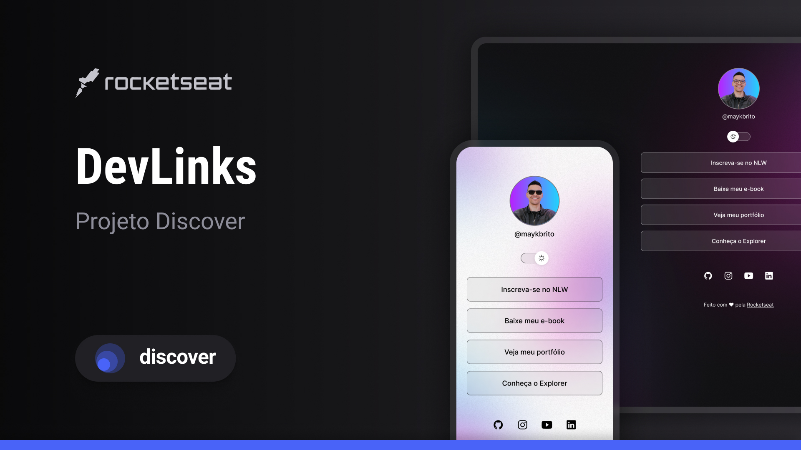

<h1 align="center"> DevLinks</h1>

​

Programa exclusivo e gratuito, promovido pela Rocketseat para ensino de tecnologias WEB.

​

  <a href="#-tecnologias">Tecnologias</a>&nbsp;&nbsp;&nbsp;|&nbsp;&nbsp;&nbsp;

  <a href="#-projeto">Projeto</a>&nbsp;&nbsp;&nbsp;|&nbsp;&nbsp;&nbsp;

  <a href="#-layout">Layout</a>&nbsp;&nbsp;&nbsp;|&nbsp;&nbsp;&nbsp;

  <a href="#memo-licença">Licença</a>

  

​

 

​

  

​

## 🚀 Tecnologias

​

Esse projeto foi desenvolvido com as seguintes tecnologias:

​

- HTML e CSS
- JavaScript
- Git e Github
- Figma

## 💻 Projeto

​

O Calendário da Copa é um projeto que mostra os jogos da Copa de 2022.

​

## 🔖 Layout

​

Você pode visualizar o layout do projeto através [DESSE LINK](https://www.figma.com/file/fLDuV4ZiqXEmIpemqwwZOz/DevLinks-%E2%80%A2-Projeto-Discover-(Community)?type=design&node-id=10-620&t=iWh3yZoYf6JEwWxA-0c). É necessário ter conta no [Figma](https://figma.com) para acessá-lo.

​

## :memo: Licença

​

Esse projeto está sob a licença MIT.

​

---

​

Feito com ♥ by Rocketseat :wave: [Participe da nossa comunidade!](https://discord.gg/rocketseat)

​